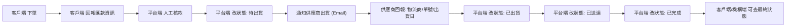
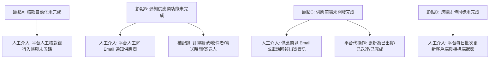

# MVP 必要功能簡易說明圖

## 1. 主流程

```mermaid
flowchart LR
  A["客戶端 下單"] --> B["客戶端 回報匯款資訊"]
  B --> C["平台端 人工核款"]
  C --> D["平台端 改狀態: 待出貨"]
  D --> E["通知供應商出貨 (Email)"]
  E --> F["供應商回報: 物流商/單號/出貨日"]
  F --> G["平台端 改狀態: 已出貨"]
  G --> H["平台端 改狀態: 已送達"]
  H --> I["平台端 改狀態: 已完成"]
  I --> J["客戶端/機構端 可查最終狀態"]
```

## 2. 節點未完成時的人工介入

```mermaid
flowchart TD
  N1["節點A: 核款自動化未完成"] --> A1["人工介入: 平台人工核對銀行入帳與末五碼"]
  N2["節點B: 通知供應商功能未完成"] --> B1["人工介入: 平台人工寄 Email 通知供應商"]
  N2 --> B2["補記錄: 訂單編號/收件者/寄送時間/寄送人"]
  N3["節點C: 供應商端未開發完成"] --> C1["人工介入: 供應商以 Email 或電話回報出貨資訊"]
  N3 --> C2["平台代操作: 更新為已出貨/已送達/已完成"]
  N4["節點D: 跨端即時同步未完成"] --> D1["人工介入: 平台每日批次更新客戶端與機構端狀態"]
```

## 3. 人工介入最小紀錄欄位

- 訂單編號
- 當前狀態
- 操作人
- 操作時間
- 備註（核款依據、通知方式、物流單號）
