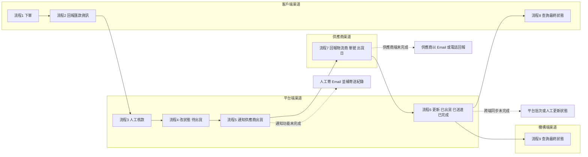

# SMART HEALTH CARE_DORA｜MVP 渠道圖（流程 x 功能對應）

資料來源：
- MVP-必要功能簡易說明圖.md
- MVP-4月底上線清單.md

## 1) 渠道流程圖（泳道視角）

## 2) 流程對應功能一覽

| 流程節點 | 主要責任渠道 | 對應必要功能 | 未完成時替代方案 |
|---|---|---|---|
| 流程1 下單 | 客戶端 | 可建立訂單 | 無（此節點必須可用） |
| 流程2 回報匯款資訊 | 客戶端 | 可填寫匯款資訊（至少末五碼） | 無（此節點必須可用） |
| 流程3 人工核款 | 平台端 | 人工核對銀行入帳與末五碼 | 持續人工核款 |
| 流程4 改狀態 待出貨 | 平台端 | 核款後可將訂單改為待出貨 | 持續人工改狀態 |
| 流程5 通知供應商出貨 | 平台端 | 供應商通知（優先系統寄信） | 平台人工寄 Email，補記錄收件者/時間/寄送人 |
| 流程6 供應商回報出貨資訊 | 供應商端 | 回報物流商、單號、出貨日 | 供應商以 Email/電話回報給平台 |
| 流程7 狀態推進 | 平台端 | 依回報更新為已出貨、已送達、已完成 | 平台代操作推進狀態 |
| 流程8 客戶查詢狀態 | 客戶端 | 顯示待出貨、已出貨、已送達、已完成 | 批次更新後可查 |
| 流程9 機構查詢狀態 | 機構端 | 顯示待出貨、已出貨、已送達、已完成 | 批次更新後可查 |

## 3) 渠道與功能關係（摘要）

- 客戶端渠道：發起流程與付款回報，最後查看狀態。
- 平台端渠道：MVP 唯一狀態控制點（核款、通知、改狀態、結案）。
- 供應商渠道：提供出貨資訊來源（系統回報或人工回報）。
- 機構端渠道：接收並查詢訂單最終狀態。

## 4) 最小追溯欄位（所有人工補位都要記錄）

- 訂單編號
- 當前狀態
- 操作人
- 操作時間
- 備註（核款依據、通知方式、物流單號）
