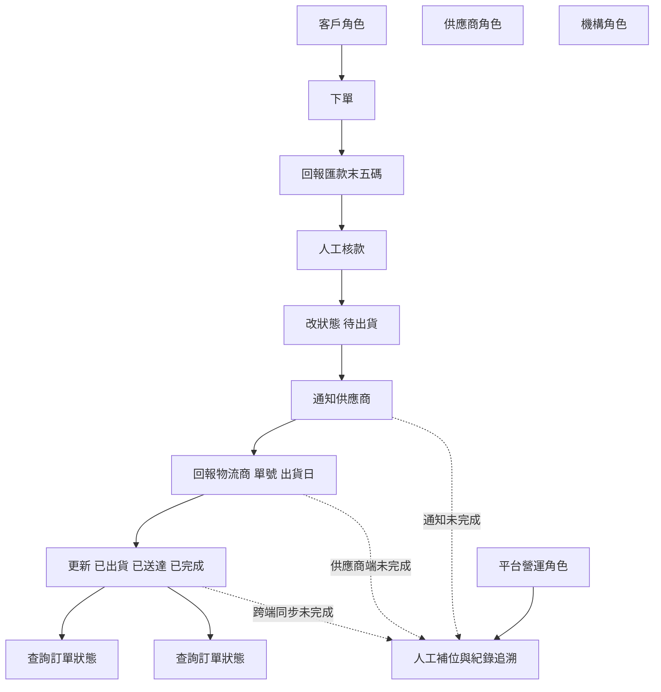

# SMART HEALTH CARE_DORA｜MVP 渠道圖（角色視角）

## 1) 角色責任圖

## 2) 角色 x 功能對照

| 角色 | 必要功能 | 交付標準 |
|---|---|---|
| 客戶 | 下單、回報匯款、查詢狀態 | 可完成付款回報，並看到待出貨/已出貨/已送達/已完成 |
| 平台營運 | 核款、通知、改狀態、結案、追溯 | 可成為唯一狀態控制點，任何缺口都可人工補位 |
| 供應商 | 回報出貨資訊 | 可提供物流商、單號、出貨日（系統或人工） |
| 機構 | 查詢狀態 | 可查看最小狀態集合 |

## 3) 上線話術（會議可直接使用）

- 客戶與機構負責「發起與查詢」，平台負責「控制與追溯」，供應商負責「出貨資訊來源」。
- 任何自動化未完成節點，都由平台營運以人工 SOP 承接，確保流程不中斷。
- MVP 成功標準不是全自動，而是每筆訂單都可被推進到已完成，且可追溯責任與時間。
